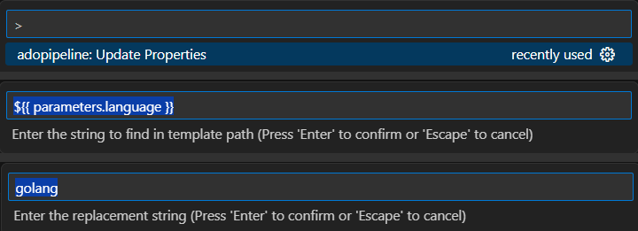

# Navigation for Azure Devops Pipeline


### How to use
- When navigation or hover is enabled, the text is underlined and formated with different color
- Use `Ctrl+Click` OR `F12` to navigate to that file/url.
#### Hover behaviour
- Hover the mouse over the path to see the resolved path or documentation URL
- Hover over a template:/file: will try to fetch the `parameters` from the target file
- Hover over a task: will try to fetch the documentation for that task
#### String replacements
- If there are values that need to be replaced before resolving the path. It allows to replace multiple find/replace and this will be replaced in the order in which its given
- For e.g. to modify the string `${{ parameters.language }}` so that it will show golang
  `Settings->User->ADO Pipeline Navigator->Adopipeline: String Replacements->Edit in settings.json`
  ```
    "adopipeline.replacementStrings": [
        {
            "find": "${{ parameters.language }}",
            "replace": "golang"
        }
    ],
  ```
- For quick modification of the replacement string can be accessed that from the Command Palette by pressing `Ctrl+Shift+P` and choose `ADO Pipeline Navigator: Replacement Strings`
  
#### Feature toggles
- Some of the features are enabled or disabled via feature toggles. These are booleans which can be set to true or false
  `Settings->User->ADO Pipeline Navigator->Adopipeline: Feature Toggles->Edit in settings.json`
  - InternetFetch => For enabling or disabling the fetching of documentation from internet
  - ReplaceStings => For enabling or disabling the string replacements
  ```
    "adopipeline.featureToggles": {
        "InternetFetch": true,
        "ReplaceStrings": true,
    }
  ```
- For quick modification of the replacement string can be accessed that from the Command Palette by pressing `Ctrl+Shift+P` and choose `ADO Pipeline Navigator: Feature Toggles`

