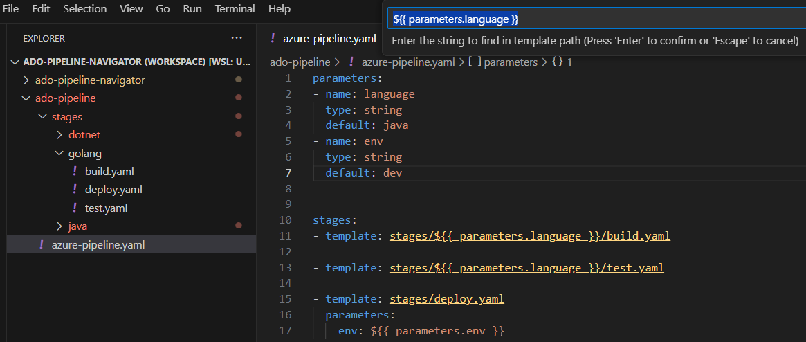

# Navigation for Azure DevOps Pipeline



## Overview
The Azure DevOps Pipeline Navigator is a Visual Studio Code extension that simplifies navigation, configuration, and management of Azure DevOps pipeline files. It offers advanced features for YAML-based pipelines, enabling seamless integration with external documentation and enhanced syntax support.

**Note**: Ensure the language is set to `azure-pipelines`, `yaml`, `markdown`, or `plaintext` to access the extension's features. This setting is typically located in the bottom-right corner of VS Code.

## Key Features

### Navigation and Integration
- **Path Navigation**: Quickly navigate to pipeline templates, files, URLs, and tasks using `Ctrl+Click` or `F12`.
- **Hover Support**: Hover over paths to see resolved paths, documentation URLs, or parameters in templates.

### Syntax Highlighting and Documentation Fetching
- **Template Parameters**: Fetch and display `parameters` from target YAML files when hovering over the template file.
- **Enhanced Syntax Highlighting**: Provides visual cues for recognized paths, tasks, and templates.
- **Task Documentation**: Automatically fetch and display task documentation from the internet.

### String Replacements
- **Dynamic Path Resolution**: Replace placeholders in paths with user-defined values, which is useful for navigating to parameterized paths like `templates/{{ parameters.language }}/build.yaml`.
- **Quick String Modification**: Modify replacement strings directly from the Command Palette (`Ctrl+Shift+P`).

### Feature Toggles
- **Internet Fetch**: Enable or disable fetching documentation from the internet.
- **String Replacements**: Enable or disable dynamic string replacements.
- **Interactive Settings**: Modify feature toggles interactively via the Command Palette.

## How to Use

### Navigation
- Recognized paths, templates, and tasks are underlined and formatted with different colors.
- Use `Ctrl+Click` or `F12` to navigate to the target file or URL.

### Hover Behavior
- Hover over a `template:` or `file:` to fetch and display `parameters` from the target file.
- Hover over a `task:` to fetch and display its documentation.

### String Replacements
- Replace placeholders in paths dynamically using user-defined find/replace rules.
- Example:
  ```json
  "adopipeline.replacementStrings": [
      {
          "find": "${{ parameters.language }}",
          "replace": "golang"
      }
  ]
  ```
- Modify replacement strings via the Command Palette (`Ctrl+Shift+P`) by selecting `ADO Pipeline Navigator: Replacement Strings`.

### Feature Toggles
- Enable or disable features such as internet fetch and string replacements.
- Example:
  ```json
  "adopipeline.featureToggles": {
      "InternetFetch": true,
      "ReplaceStrings": true
  }
  ```
- Modify feature toggles via the Command Palette (`Ctrl+Shift+P`) by selecting `ADO Pipeline Navigator: Feature Toggles`.

## Installation
1. Install the extension from the Visual Studio Code Marketplace.

## Support
For any issues or feature requests, please open an issue on the [GitHub repository](https://github.com/HPInc/ado-pipeline-navigator).

## License
This extension is licensed under the [MIT License](LICENSE).
