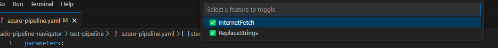

# Simplifying Azure DevOps Pipeline Workflows with ADO Pipeline Navigator
Managing Azure DevOps YAML pipelines can be challenging, especially when dealing with complex pipelines involving multiple templates, tasks, and parameters. Enter the **ADO Pipeline Navigator**, a Visual Studio Code extension designed to streamline and enhance your workflow. In this blog, we’ll explore how this extension can revolutionize the way you work with Azure DevOps pipelines.

## The Challenge
Updating a complex pipeline with multiple templates and tasks can be daunting. Microservice pipelines often include templates for Linting, Building artifacts, Scanning for vulnerabilities, Creating Docker images, Publishing images, Deploying them etc

To simplify this, a top-level template is typically created, encapsulating sub-templates for each action. Developers only need to include this top-level template in their pipeline file and pass the required parameters.

While this approach simplifies development, it complicates understanding or modifying the pipeline due to the multiple templates and tasks involved.

## The Solution: ADO Pipeline Navigator
The **ADO Pipeline Navigator** extension is a game-changer for developers working with Azure DevOps pipelines. It integrates seamlessly with Visual Studio Code, offering features to simplify and enhance your workflow.

### Syntax Highlighting
Your files will automatically display decorations and clickable links, using underlines and colors to indicate recognized paths, tasks, and templates.

### Template Navigation and Preview File
Clickable links are highlighted with a yellow underline. Hovering over them shows the resolved path and previews the template or file contents. By default, parameters, stages, jobs, and steps are previewed. You can configure the keywords to preview in the settings (`ado-pipeline-navigator.keywordsToDisplayOnHover`). This feature helps you understand template parameters without opening the file. Use `Ctrl+Click` or `F12` to navigate to the referenced path.

### Document Fetching
Azure Pipeline tasks are also decorated with a yellow underline. Hovering over a task fetches its documentation from the internet. Use `Ctrl+Click` or `F12` to open the documentation link in your browser.

### Dynamic String Replacements
If your template path contains variables, such as `templates/${{ parameters.language }}/build.yaml`, you can dynamically change their values using the Command Palette (`Ctrl+Shift+P`). Select **ADO Pipeline Navigator: Replacement Strings** and add find/replace strings (e.g., search for `${{ parameters.language }}` and replace with `java`). This is especially useful for language-specific configurations.

### Feature Toggles
- **Internet Fetch**: Enable or disable fetching documentation from the internet.
- **String Replacements**: Enable or disable dynamic string replacements.

## How to Get Started

### Installation

1. Install the **ADO Pipeline Navigator** extension from the Visual Studio Code marketplace.
2. If the Azure pipeline templates are in a different repository, add that repository to the workspace or include it in one of the top-level folders.

### Activating the Extension

> **Note**: Ensure the Language Mode in the status bar (bottom-right corner of VS Code) is set to `Plain Text`, `azure-pipelines`, `yaml`, or `markdown`.

The extension activates automatically when you open a YAML file in your workspace.

## Conclusion
The **ADO Pipeline Navigator** extension is more than just a tool; it’s a productivity enhancer for developers working with Azure DevOps pipelines. By simplifying navigation and improving understanding, it allows you to focus on what truly matters — building and managing robust CI/CD pipelines.

Try the **ADO Pipeline Navigator** today and experience the difference it can make in your workflow. Happy coding!

**Bugs or Feature Requests**: Add them here: [Issues · ado-pipeline-navigator](https://github.com/ado-pipeline-navigator/issues). Please note this is a side project, so expect delays.
